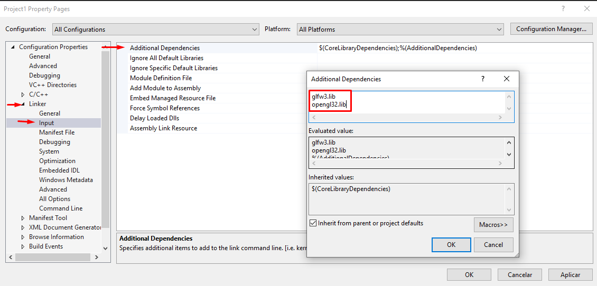

# ⚙️ Configuração e Criação do Projeto OpenGL


1. **Baixe o CMake**
    - Site: [https://cmake.org/download/](https://cmake.org/download/)
    - Instale conforme o sistema.

2. **Baixe o GLFW**
    - Site: [https://www.glfw.org/download.html](https://www.glfw.org/download.html)
    - Extrair o conteúdo.
    - Criar pasta `build` na pasta principal extraída.

3. **Baixe o GLAD**
    - Gerador online: [https://glad.dav1d.de/](https://glad.dav1d.de/)
    - Extrair o conteúdo.

4. **Criando build do GLFW**

    

    - Abra o CMake.
    - Em `Browse source...` selecione o destino da pasta extraida do GLFW.
    - Em `Browse build... ` selecione o destino da pasta build que foi criada.
    - Aperte em `Configure`, essa ação é feita duas vezes.
    - Aperte em `Generete`
    - Feche o CMake.
    - Abra o projeto *GLFW.sln* criado na pasta `build`.
    - Faça o build em **Build Solution**:

        

    - Ao terminar, feche o Visual Studio.

5. **Criando o projeto**

    
    - Crie um projeto vazio c++ no Visual Studio.
    - Vá ate a pasta o projeto, e crie as pastas libraries/lib e libraries/include.

6. **Mova os arquivos**
    - Mova o arquivo `glfw\build\src\Debug\glfw3.lib` para `Project\libraries\lib`.
    - Mova a pasta de `glfw\include\GLFW` para `Project\libraries\include`.
    - Mova as que estao dentro de `glad\include\` para `Project\libraries\include`.
    - Mova o arquivo `glad\src\glad.c` para `Project`.

7. **Configuração no Visual Studio**
    - Adicione `glad.c` em *Source Files*:

        
    - Abra as propriedades do projeto.
    - Em VS++:

        
        - Faça referência a pasta include e os globais do windows em **Include Directories**: `$(SolutionDir)libraries\include;$(IncludePath)`
        - Faça referência a pasta lib e os globais do windows em **Library Directories**: `$(SolutionDir)libraries\lib;$(LibraryPath)`
    - Em Linker->Input:

        
        - Adicione as bibliotecas glfw e opengl em *Additional Dependecies*.

8. **Executando o projeto**
    - Crie o arquivo Main.cpp em *Source Files*

        
    - Cole o código:
    ```
    #include<iostream>
    #include<glad/glad.h>
    #include<GLFW/glfw3.h>


    int main()
    {
        return 0;
    }
    ```
    - Execute o projeto:

        

9. **Aplicação configurada**
    - Se tudo foi feito corretamente, terá uma tela de saída sem erros:

        