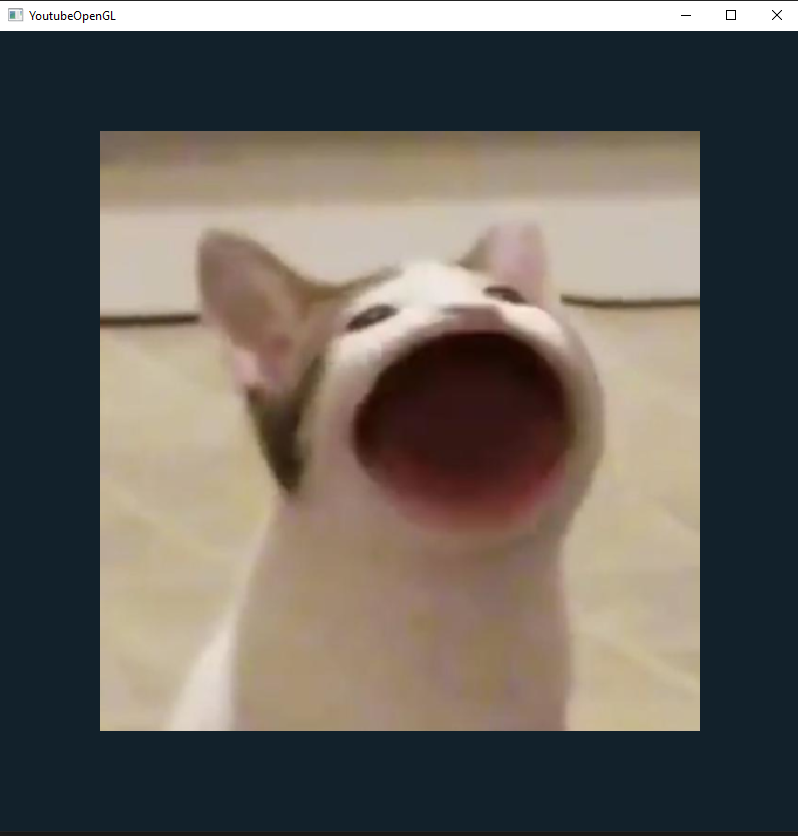

# Texturas - Desenhando imagem em cima dos objetos


Nessa implementação foi modelado um **quadrado** através de dois triangulos:

```c++
GLfloat vertices[] =
{//|     Coordenadas  |       Cores       | Textura Coord.  //  
     0.5f,  0.5f, 0.0f,   1.0f, 0.0f, 0.0f,   1.0f, 1.0f,  // Top Right
    -0.5f,  0.5f, 0.0f,   0.0f, 1.0f, 0.0f,   0.0f, 1.0f,  // Top Left
    -0.5f, -0.5f, 0.0f,   0.0f, 0.0f, 1.0f,   0.0f, 0.0f,  // Bottom Left
     0.5f, -0.5f, 0.0f,   1.0f, 1.0f, 1.0f,   1.0f, 0.0f   // Bottom Right
};

GLuint indices[] = {
    0, 1, 2,  // Triângulo 1
	0, 2, 3  // Triângulo 2 
};
```

Agora, para fazer o carregamento dos bytes de uma imagem, foi necessário adicionar o pacote STB:
- [código stb_image.h](https://raw.githubusercontent.com/nothings/stb/master/stb_image.h)

## Instalando pacote STB
- crie o arquivo `libraries/include/stb/stb_image.h` e cole o código do pacote STB.
- crie a classe stb.cpp:
    ```c++
    #define STB_IMAGE_IMPLEMENTATION
    #include<stb/stb_image.h>
    ```

## Classe de textura
Será necessário cria uma classe para poder fazer a chamada da imagem e desenhar em cima do objeto.

Para isso:
- crie a interface: Texture.h
- crie a classe: Texture.cpp

Na classe de textura seu construtor irá fazer o carregamento dos bytes da imagem através de:
```c++
int widgthImg, heightImg, numColCh;
stbi_set_flip_vertically_on_load(true); // Inverte a imagem ao carregar
unsigned char* bytes = stbi_load(image, &widgthImg, &heightImg, &numColCh, 0);
```

E para forma de validação do carregamento, o log:
```c++
std::cout << "Width: " << widgthImg
	<< " Height: " << heightImg
	<< " Channels: " << numColCh << std::endl;

if (!bytes) {
	std::cout << "Falha ao carregar imagem!" << std::endl;
}
```

Após isso, será feito a construção dos pixels em cima do objeto:
```cpp
glGenTextures(1, &ID);
glActiveTexture(slot);
glBindTexture(texType, ID);

glTexParameteri(texType, GL_TEXTURE_MIN_FILTER, GL_NEAREST);
glTexParameteri(texType, GL_TEXTURE_MAG_FILTER, GL_NEAREST);

glTexParameterf(texType, GL_TEXTURE_WRAP_S, GL_REPEAT);
glTexParameterf(texType, GL_TEXTURE_WRAP_T, GL_REPEAT);


// float flatColor[] = { 1.0f, 1.0f, 1.0f, 1.0f };
// glTexParameterfv(texType, GL_TEXTURE_BORDER_COLOR, flatColor);

glTexImage2D(texType, 0, GL_RGBA, widgthImg, heightImg, 0, format, pixelType, bytes);
glGenerateMipmap(texType);

stbi_image_free(bytes);
glBindTexture(texType, 0);
```

A classe também terá a funcção **texUnit** para a ativação do *Shader*, que no caso é quando a imagem sobrepõe o objeto.
```cpp
void Texture::texUnit(Shader shader, const char* uniform, GLuint unit)
{
	GLuint texUni = glGetUniformLocation(shader.ID, uniform);
	shader.Activate();
	glUniform1i(texUni, unit);
}
```

E as funções base:
```cpp

void Texture::Bind()
{
	glBindTexture(type, ID);
}

void Texture::Unbind()
{
	glBindTexture(type, 0);
}

void Texture::Delete()
{
	glDeleteTextures(1, &ID);
}
```
## Main.cpp
Na classe principal será feito a construção do *Shader* através do construtor da classe de textura (indicando o caminho da imagem):
```cpp
Texture popCat("C:\\Users\\Romario Melo\\Documents\\estudos-opengl\\docs\\images\\06\\pop_cat.png", GL_TEXTURE_2D, GL_TEXTURE0, GL_RGBA, GL_UNSIGNED_BYTE);
popCat.texUnit(shaderProgram, "tex0", 0); //Ativação da textura
```

Já dentro do loop da janela, sera feito o vinculo do desenho a janela
```cpp
popCat.Bind();
```

e logo a após o fechamento da janela a textura será apagada
```cpp
popCat.Delete();
```

---
## Resultado da janela
