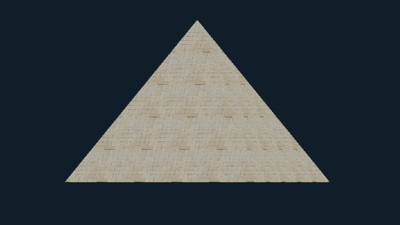

# Objeto 3D - Desenhando uma pirâmide

## Instalação do OpenGL Mathematics
- [site de download](https://glm.g-truc.net/0.9.9/index.html)
- mova a pasta `(glm/glm).zip` para `libraries/include/`

## Construindo a pirâmide

Foi feito as alterações nas coordenadas dos vertices para a construção da pirâmide, e em seguida, foi carregado a imagem para a construção da pirâmide.

Foi criado antes do loop da janela, as variáveis de controle da rotação, e do tempo, e também a função de ativação para o teste de profundidade.

```cpp
float rotation = 0.0f; // Variável para armazenar o ângulo de rotação
double prevTime = glfwGetTime();  // Tempo do frame anterior  

glEnable(GL_DEPTH_TEST); // Habilita o teste de profundidade
```
Já dentro do loop da janela também foi necessário adicionar a limpeza do buffer de profundidade `GL_DEPTH_BUFFER_BIT`.

Foi adicionado ao loop da janela logo após a ativação do programa de shaders, as matrizes de transformação

```cpp
// Cria transformações (OBS: Sempre após a ativação do Programa de Shaders)
glm::mat4 model = glm::mat4(1.0f);
glm::mat4 view = glm::mat4(1.0f);
glm::mat4 proj = glm::mat4(1.0f);

// Rotaciona o modelo ao redor do eixo Y
model = glm::rotate(model, glm::radians(rotation), glm::vec3(0.0f, 1.0f, 0.0f));
// Translada a câmera para trás (no eixo Z)
view = glm::translate(view, glm::vec3(0.0f, 0.5f, -2.0f));
// Define a projeção perspectiva
proj = glm::perspective(glm::radians(45.0f), (float)WIDTH / (float)HEIGHT, 0.1f, 100.0f);

// Passa as matrizes para os uniformes do shader
int modelLoc = glGetUniformLocation(shaderProgram.ID, "model");
glUniformMatrix4fv(modelLoc, 1, GL_FALSE, glm::value_ptr(model));
int viewLoc = glGetUniformLocation(shaderProgram.ID, "view");
glUniformMatrix4fv(viewLoc, 1, GL_FALSE, glm::value_ptr(model)); 
int projLoc = glGetUniformLocation(shaderProgram.ID, "proj");
glUniformMatrix4fv(projLoc, 1, GL_FALSE, glm::value_ptr(model));
```

---
## Resultado da janela
